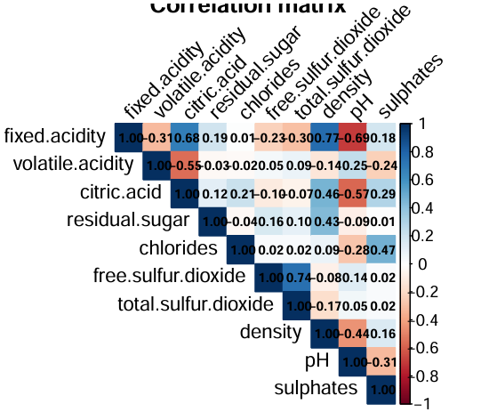
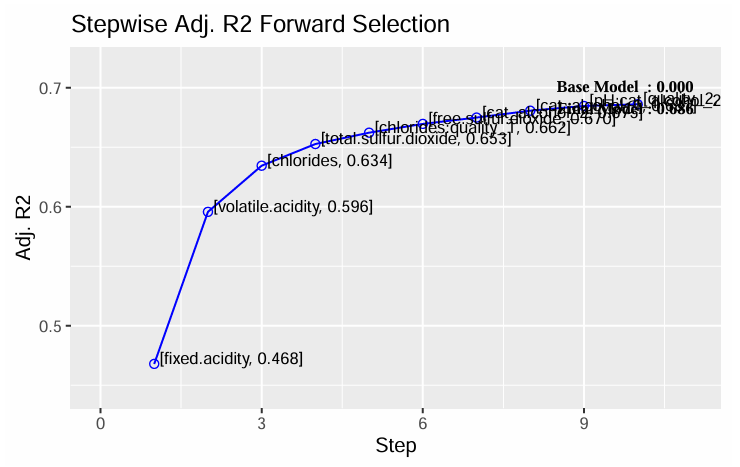
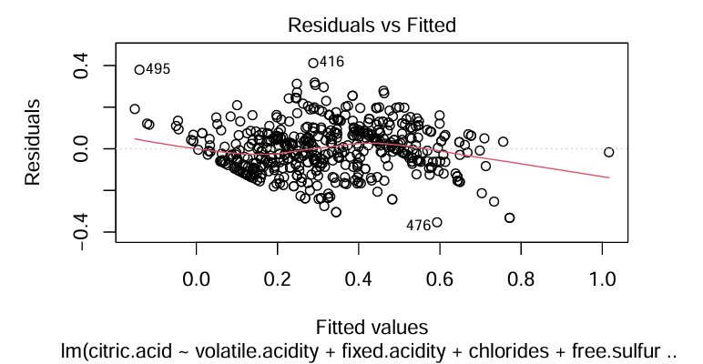
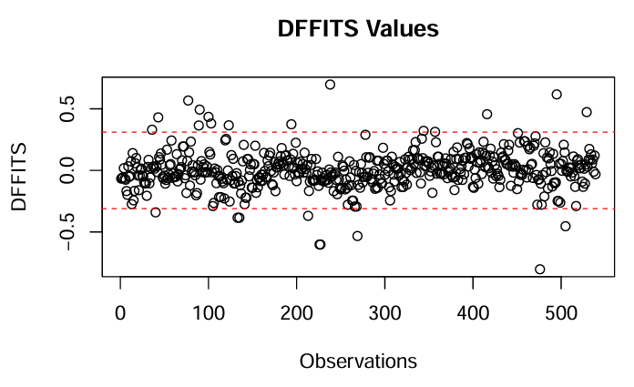

# Wine Quality Linear Regression

Multiple linear regression analysis of the Wine Quality dataset using classical linear modeling techniques in R.

This project develops and validates a linear regression model to explain the factors influencing **citric acid concentration** in red wines. The analysis includes feature engineering, model selection, diagnostic testing, statistical inference, and model validation.

---

## Authors

- Mateus Auza Cruz
- Yassine Zeamari

---

## Dataset

This project uses the **Wine Quality Dataset** from the UCI Machine Learning Repository.

Original source:

[UCI Machine Learning Repository – Wine Quality Dataset](https://archive.ics.uci.edu/dataset/186/wine+quality)


The dataset contains physicochemical measurements of Portuguese *Vinho Verde* wines and is commonly used for regression and classification problems.

---

## Project Objectives

The project aims to:

- Build a multiple linear regression model for predicting **citric acid concentration**.
- Select the best subset of predictors.
- Verify the classical assumptions of linear regression.
- Detect influential observations and multicollinearity.
- Evaluate predictive performance on a validation dataset.
- Interpret the effects of quantitative and qualitative variables.

---

## Repository Structure

```text
.
├── code/
│   └── code.qmd
├── data/
│   └── Wine_data.txt
├── figures/
│   ├── correlation-matrix.png
│   ├── dffits.png
│   ├── forward_selection.png
│   └── residuals_vs_fitted.png
├── report/
│   └── report.pdf
├── LICENSE
└── README.md
```

---

## Methodology

The analysis consists of:

1. Data preprocessing
2. Exploratory Data Analysis
3. Best subset selection
4. Forward model selection
5. Linear regression diagnostics
   - Linearity
   - Influential observations
   - Multicollinearity
   - Heteroskedasticity
   - Autocorrelation
6. Model refinement
7. Statistical inference
8. Validation using prediction intervals

---

# Results Preview

## Correlation Matrix

Understanding the relationships among the numerical variables before model construction.



---

## Forward Model Selection

Selection of the optimal regression model based on Adjusted R².



---

## Residuals vs Fitted

Diagnostic plot used to assess the linearity assumption.



---

## DFFITS

Detection of influential observations used during model refinement.



---

## Main Results

- Selected a parsimonious multiple linear regression model using best subset and forward selection.
- Removed influential observations identified through DFFITS.
- Resolved multicollinearity using the Variance Inflation Factor (VIF).
- Corrected heteroskedasticity using Weighted Least Squares.
- Addressed autocorrelation using the Cochrane–Orcutt procedure.
- Achieved approximately **90% prediction interval coverage** on the validation set.

The final model provides meaningful statistical inference, although the validation results suggest that the relationship between the predictors and citric acid concentration may not be perfectly linear.

---

## Software

The project was developed in **R** using Quarto.

Main packages:

- dplyr
- ggplot2
- patchwork
- corrplot
- olsrr
- fastDummies
- car
- lmtest
- skedastic
- moments

---

## Report

The complete report is available in `report/report.pdf`.

---

## License

This repository is distributed under the MIT License.
